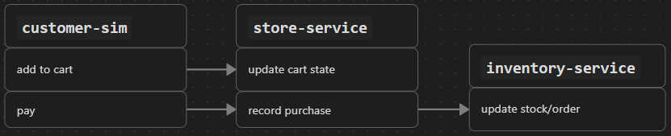

DL-002 Structural Organization  
date: 2025-12-17
System Context: Project bootstrap — System organization  
Design Criterion: Exploratory

---

As mentioned during inception, the system is divided into three main parts: `customer-sim`, `store-service`, and `inventory-service`. Each partition represents an independent service. [Development Log 001](../devlogs/001-project-setup-and-config.md) details how this partitioning was implemented using containers for each service.

At this point, we describe at a high level how these services are expected to interact at runtime (component & connector view). To simplify the description, we rely on existing domain terminology:

- **`customer-sim`** is the system component responsible for generating the events we define as demand. Demand represents users performing actions such as _add to cart_ and _purchase_. At runtime, these events translate into requests directed to the store service. It is not yet decided whether these interactions will be implemented synchronously or asynchronously.

- **`store-service`** receives a request, processes the contained data, and records the event as a transaction. If the transaction corresponds to a purchase, the store service emits a signal that is consumed by the inventory service, triggering stock updates.
    
- **`inventory-service`**, in addition to updating inventory levels, generates purchase orders once certain conditions on inventory state (e.g., stock thresholds) are met.

Conceptually, these interactions can be visualized as follows:

This high-level description already carries some non-trivial implications. For example, while `customer-sim` will communicate over HTTP, modeling a shopping cart also implies the need for some notion of customer identity and state, at least for the duration of an active purchase.

At this stage, the goal is not to commit to implementation details, but to define a conceptual shape of the system — enough to reason about global behavior and to guide development, without hardening structural decisions too early.

The next design log will explore patterns and structural options for `customer-sim`, with the goal of incrementally developing the ideas introduced here.
