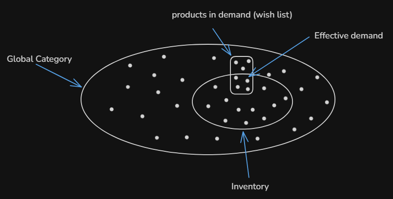
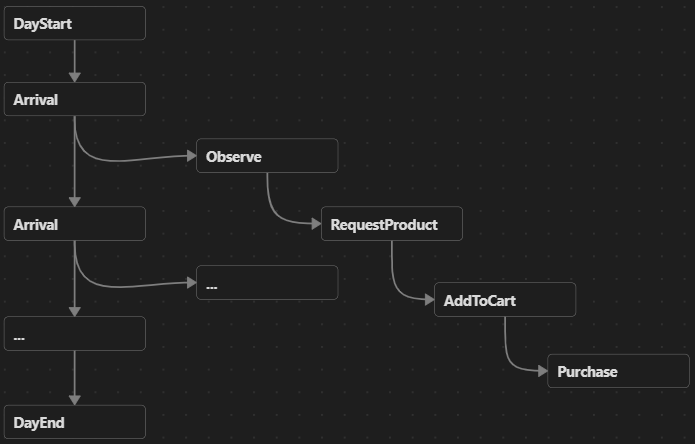

**date:** 2026-05-20
**System Context:** Project bootstrap — System organization
**Design Criterion:** Design exploration (design-driven)

---

### Context

In this log, the `customer-sim` layer is explored from a conceptual and domain-oriented perspective, focusing on its responsibilities, core abstractions, and relationships with the rest of the system. The objective is to establish a clear domain model that can guide future module-level design decisions, particularly regarding how customer behavior translates into demand generation and inventory interactions.

---

### Problem framing

The `customer-sim` layer is responsible for generating synthetic demand by simulating customer actions within a store (e.g., adding products to a cart, completing a purchase).

This requires defining:

- How time progresses in the simulation.
- How customer behavior is modeled.
- How simulated actions interact with the store system.

---

### Simulation approach

The `customer-sim` layer is modeled as a simulation system, where a simplified representation of customer behavior is used to analyze and test domain functionality in a controlled environment.

In this context, rather than focusing on prediction accuracy, the goal of the simulation is to **explore functionality and validate** the store system under different demand scenarios.

**There are different techniques for designing a simulation, among which the following stand out:**

**Discrete Event Simulation (DES):**  
This type of simulation models the evolution of a system as a sequence of discrete events over time. Each event occurs at a specific instant and causes a change in the system’s state, which remains constant between events.  
The approach is centered on processes, flows, and global state changes, where entities (e.g., customers) move through the system according to logic defined by events and queues.

**Agent-Based Simulation (ABS):**  
This type of simulation models the system as a collection of autonomous agents, each with internal state and behavioral rules. Agents interact with each other and with their environment, updating their state based on those interactions.  
The approach is centered on individual behavior and on how interactions among multiple agents can give rise to emergent patterns or system-level dynamics.

**For the present simulation, a hybrid approach is proposed:** discrete events are used to structure the progression of time and system-level state changes, while buyers are modeled as agents with internal state and behavior dependent on their environment.

---

### Model overview:

Below, we will describe some of the elements, characteristics, and behaviors of the simulation. Because the system we are trying to model is non-deterministic, a comprehensive description is not possible. Nevertheless, we can highlight some important elements that will help us better understand the problem the simulation is intended to solve.

#### Demand

The model considers two complementary aspects for simulating demand:

1. Generation of environmental conditions through probability distributions, which establish the initial state under which agents operate, and introducing a certain degree of variability that is expected in demand processes.
2. Agent behavior, where buyers make decisions based on a finite set of rules, while interacting with the store system and their surrounding conditions.

Parts of the environment are initialized stochastically. For example, income distributions are used to assign budgets to buyers, while a distribution like weighted categorical can be used to model product selection. Once initialized, buyers interact with the store according to their internal state and behavioral rules. The store acts as a shared interaction node between agents, introducing indirect competition for limited resources such as inventory. This approach aims to simplify several aspects of real-world demand generation in order to maintain tractability while still enabling the emergence of meaningful purchasing dynamics.

Now, let's look at how each buyer's wish list can be obtained in this initial model:
1. A global category of products is defined, representing the full set of products available in the domain. A probability distribution is assigned over this set, where each product has an associated weight reflecting its likelihood of being selected. 
2. Based on this distribution, a buyer's wish list is generated through a stochastic sampling process. This represents the set of products that the buyer intends to purchase, allowing for more realistic behavior when interacting with the store system, by making requests for a set of products regardless of the store's inventory.
3. The store inventory is defined as a subset of the global product set.
4. A buyer’s _effective demand_ is defined as the intersection between their wish list and the store’s inventory. This represents the set of products the buyer intends to purchase and that are actually available.

_Figure: A set-like representation of products._

Here, we can see that:
- __Inventory__ and __wish list__ are subsets of the __global category__.
- __Effective demand__ is the intersection between both the __inventory__ and __wish list__.

This raises the following questions:
- How are the buyer’s strategy and the size of the wish list determined?
- Will there be a purchasing strategy for each product, or for the entire wish list?
- What determines the preference for one product over another and the final choice, given that there is a budget constraint?

Although these questions are relevant for achieving a relatively organic and realistic demand behavior, I believe they represent lower-level design decisions, since the focus here is on obtaining an overall picture of the model that allows us to identify some of the most visible elements, namely: the set of products, a basic buyer-agent model, and the most basic interaction between the buyer and their environment.

#### Time representation and event generation

Time will be modeled using the **next-event time advance mechanism**, in which a simulated clock is initialized to zero (0), time progresses in discrete increments, and the occurrence times of future events are determined stochastically. A key feature of next-event time advance is that the clock advances to the occurrence time of the most imminent event in the future, allowing for greater efficiency in computing resources.

In our model, the time structure is as follows:
- A day, with a duration of 24 × 60 = 1,440 minutes. This means that, at least for this initial design, the unit of time is the minute.
- A number of days specified in the simulation's user settings.

The events that will mark the passage of time are:
- Start of day.
- End of day.
- Agent events: arrival, observation, request for product information, add to shopping cart, and purchase.

The simulated time will depend on a probability distribution (Poisson process) applied to the inter-arrival times, allowing events to be distributed stochastically over a given period. Furthermore, since a simulation aims to represent causal processes with a certain degree of realism, each event will trigger future events that depend on the causal chain, as illustrated below:

_Figure: A tree-like representation of a subset of events in the simulation._

The next design log will describe some of the classes and entities that will be experimented with, in order to arrive at a draft structure for the simulator.
